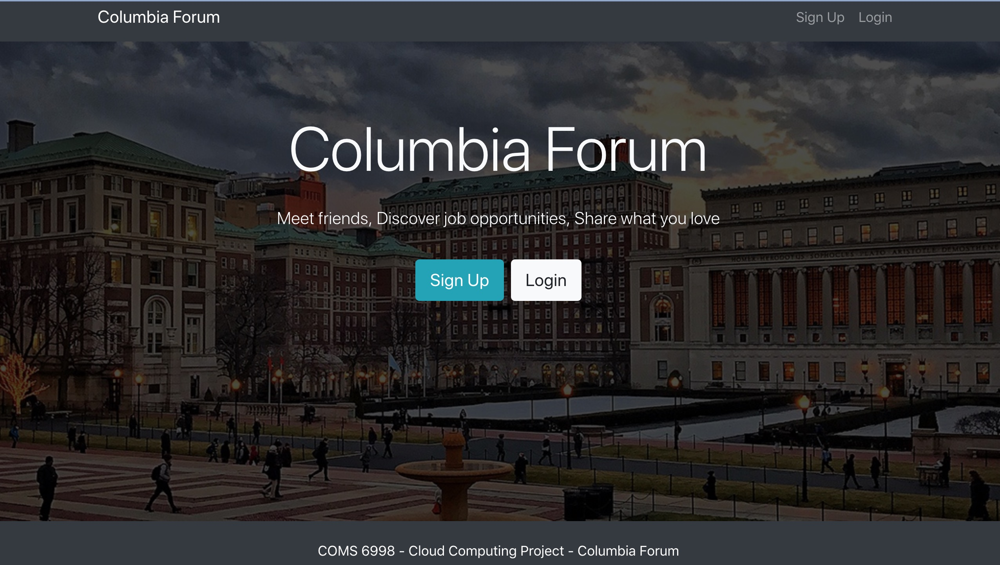
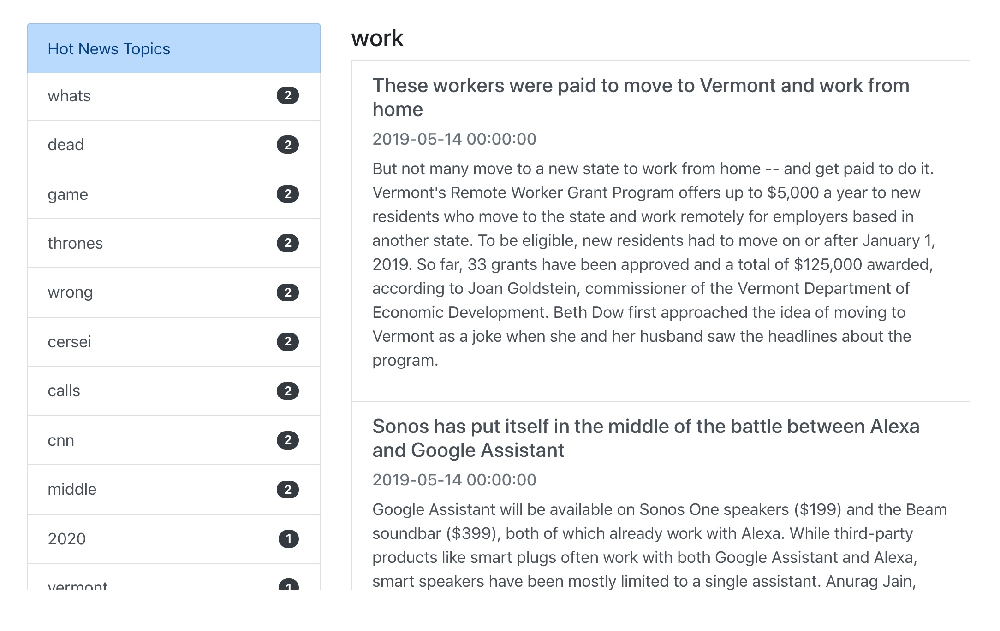
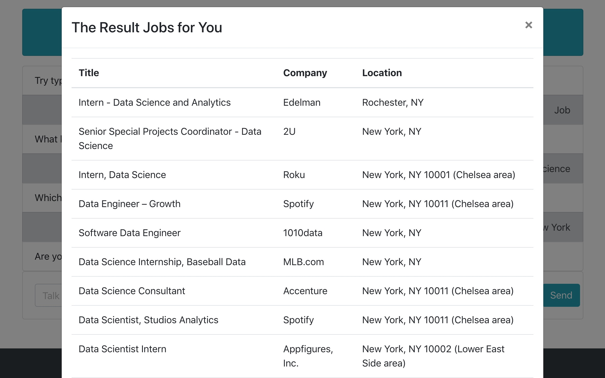
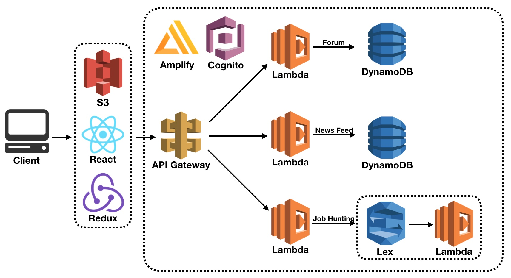
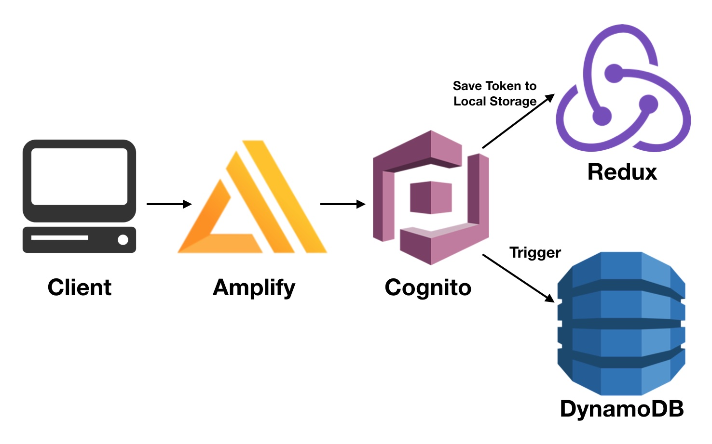
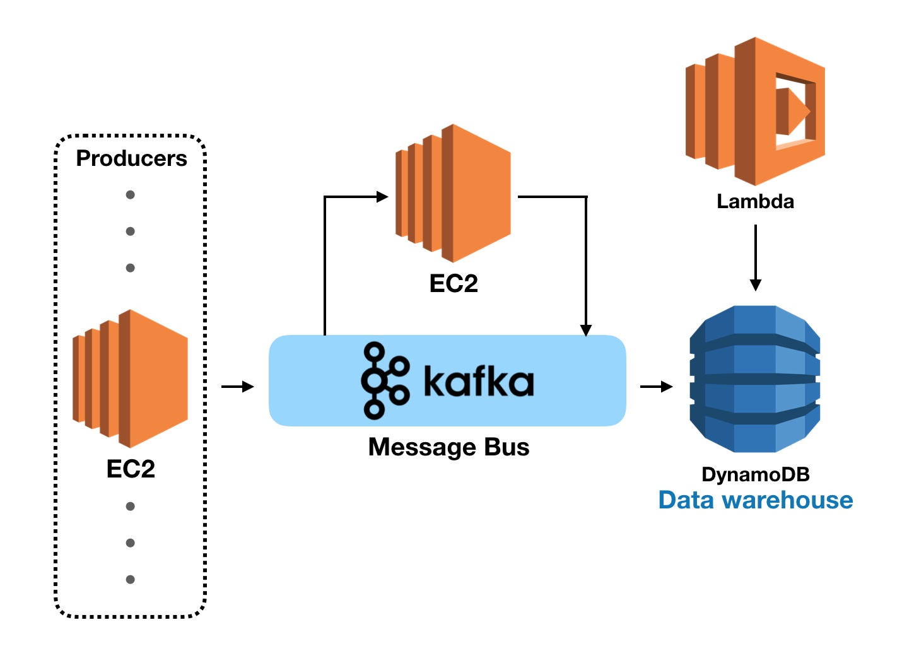

# Columbia-Forum

Course project for COMS 6998 Cloud Computing

## Demo

Demo url:

_If you don't have redux extension_

> http://columbia-forum-demo-no-redux.s3-website.us-east-1.amazonaws.com/

_If you have redux extension_

> http://columbia-forum-demo.s3-website.us-east-2.amazonaws.com/

Demo video url:

> <https://youtu.be/IbzOZIZyzRM> 

Demo sildes url:

> <https://drive.google.com/open?id=18HRcw2wvYLU4WmILiLT3D-MBb31iRf-0>

Landing page:

Forum:

News feed:

Job hunting:

## Architechture

Basic architecture:

Authentication:

News-feed:

